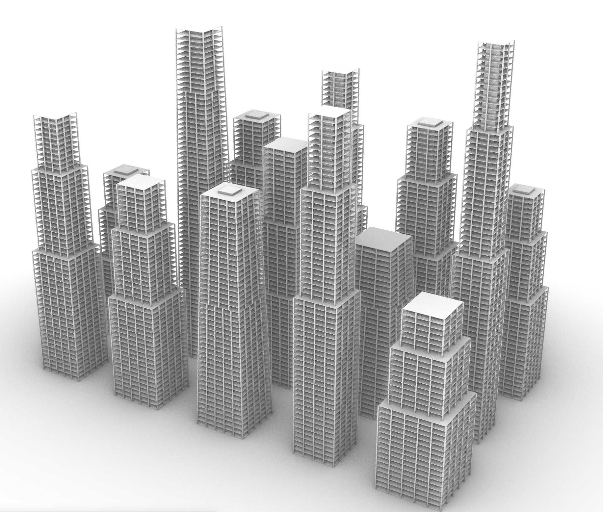

# rhinoBot


A collection of professional Rhino skills designed to enable Gemini CLI to perform sophisticated parametric modeling in Rhinoceros via the Rhino MCP Server.

## 🏗️ Available Skills

### 1. rhino-skyscraper-generator
A parametric tool for creating structurally realistic skyscrapers with central cores, floor slabs, and complete column grids.

#### **Key Features:**
- **Parametric Height**: Generate buildings from 10m up to 300m+.
- **Structural Integrity**: Includes a central core and a distributed column grid (e.g., every 8 meters).
- **Floor Tapering**: Automatic footprint setbacks for architectural variety.
- **Layer Organization**: Automatically sorts objects into `Core`, `Slabs`, and `Columns` layers.

---

## 🚀 Installation

To add the skyscraper generator to your Gemini CLI, ensure you have the [Rhino MCP Server](https://github.com/jingcheng-chen/rhinomcp) running, then execute:

```bash
gemini skills install https://github.com/LeoYuanjieLi/rhinoBot --path rhino-skyscraper-generator --consent
```

After installation, enable the skill in your active session:
```bash
/skills reload
```

---

## 🛠️ How to Use

Once installed, you can simply ask Gemini to generate buildings for you:

> "Build a 200m skyscraper at the origin with a column grid every 10 meters."
>
> "Create a cluster of 5 buildings with varying heights and shapes."

Gemini will automatically leverage the bundled `generate_skyscraper.py` script to perform the modeling work in your active Rhino document.

---

## 📈 Performance
In testing, generating a complex, structurally complete skyscraper using this skill is **~100x faster** than manually researching and coding the same geometry from scratch.
